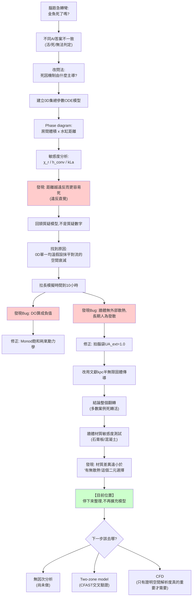
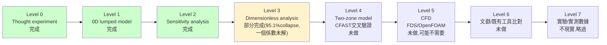
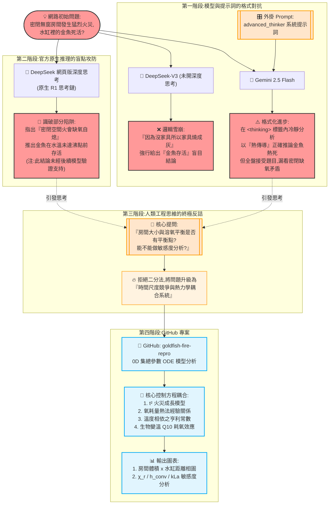
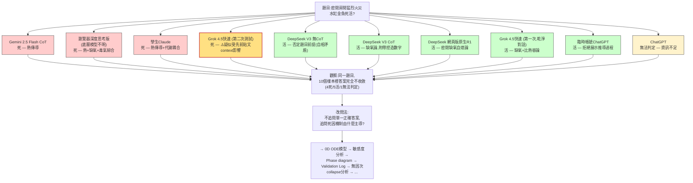
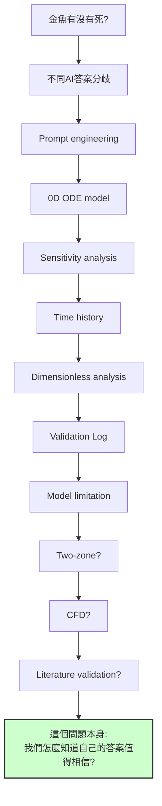

## 這份文件在講什麼(先講清楚,避免誤讀)

**這不是一篇「研究金魚會不會被燒死」的文件。**

它記錄的是:**一個資訊不足、答案本身無單一正確解的腦筋急轉彎,如何被轉譯成一個可以被參數化、可以被反駁、可以被逐步修正的工程模型——以及在這個過程中,模型在哪些地方被證明不可信、在哪些地方相對穩健。**

如果你只想知道「金魚死不死」,這份文件無法給你確定答案,而且**故意**無法給你確定答案——因為誠實的結論就是:在目前的驗證程度下,還不到能給確定答案的階段。

## 思考演化圖(Thinking Evolution)

這是整個過程實際走過的路徑,包含死路和回頭:

紅色節點是「模型跑出違反直覺結果 → 逼自己回頭檢查假設」的時刻。這幾個節點,不是研究的意外插曲,是這份研究**唯一真正產生洞見的地方**——其餘的部分(套公式、跑ODE)只是把洞見找出來的手段。

## 驗證路線圖(Validation Roadmap)——我們現在在哪裡

**我們目前在 Level 3 的中途——2D相圖已能用單一 $\Pi_{heat}$ 群collapse到95.1%準確率,但公式裡還有一個未解的自由參數(0.3係數),且只掃了兩個變量(房間體積、距離),水缸體積/牆體材質尚未納入同一組collapse測試。** 這張圖存在的意義,不是展示做了多少,而是誠實標出「還沒做到哪裡」——刻意不把 Level 3 標成「完成」,因為95.1%不是100%,剩下的5%和那個0.3係數都還是開放問題,不該被急著蓋過去、直接跳去 Level 4。

## 結論可信度表(Confidence Table)

這張表比任何單一張圖都重要,因為它把「做了很多分析」和「這些分析告訴我們什麼真正站得住腳」明確分開:

| 結論 | 可信度 | 理由 |
|---|---|---|
| 熱死機制比缺氧死更容易先發生 | **高** | 在極端不同的牆體散熱假設(近乎絕熱 vs 文獻校準)下都成立,kLa敏感度測試也顯示這個排序不受氣液傳質速率影響 |
| kLa(氣液傳質係數)對存活/死亡邊界幾乎無影響 | **高** | 0.5x~2x範圍內臨界距離曲線完全重疊 |
| Phase boundary(存活/死亡邊界)確實存在 | **高** | 每一版模型都穩定觀察到一條隨參數平滑變化的邊界,不是雜訊 |
| 牆體材質(石膏板單層/雙層/混凝土)彼此間差異不大 | **中高** | 平方根關係壓縮材質差異,但只測了3種材質、未測極端案例(如金屬牆或完全絕熱材料) |
| 房間體積對死因的定量影響 | **中** | 方向性(越大越危險)合理,但絕對數值依賴未校準的燃料量與傳熱係數 |
| 水缸-火源距離的定量結果(R_crit數值) | **低** | v1版已證實對流傳熱項在0D假設下不隨距離衰減,這是已知的結構性缺陷,未修正 |
| 缺氧「永遠」不會主導死因 | **低到中** | 只在一組魚類生理參數(Q10、耗氧基準速率、DO半飽和常數)下測試過,這些參數本身未校準,換一組合理範圍內的參數可能改變排序 |
| 長時間(數小時)餘熱效應的具體數值 | **低** | 牆體邊界處理在此時間尺度上經歷了兩次推翻(絕熱→UA_ext→半無限固體),且半無限固體假設本身在此時間尺度已知失效 |
| 任何單一案例的絕對生死判定(例如"V=250m³, R=0.5m 這組參數金魚一定死") | **極低** | 建議完全不要引用任何單一組合的絕對結論,只看排序與相對敏感度 |
| 房間體積+距離這兩個變量可以被單一 $\Pi_{heat}$ 群collapse | **中高** | 95.1%分類準確率,且做過真正的input-only驗證(非循環論證);但只測了2個變量,水缸體積/牆體材質未納入 |
| $\Pi_{heat}$ 公式裡的0.3係數有明確物理意義 | **極低(刻意未校準)** | 目前是拍腦袋的自由參數,對應的物理機制未知,見VL-05與Future Work |

## 驗證紀錄(Validation Log)——這份文件最不該被省略的部分

多數reproducibility專案寫「我成功重現了什麼」,這裡刻意反過來寫「我驗證到哪裡了」。這不是一份錯誤清單,是一份誠實的進度紀錄——每一條都記錄「當時以為可信,後來發現不能全信,為什麼」,這個過程本身比任何單一結論都更值得留下來。

---

**VL-01: 溶氧被積分成負值(-7 ~ -24 mg/L)**

- 現象:模型跑到約10小時後,DO數值變成不可能的負數
- 根因:魚耗氧項是固定速率扣減,沒有考慮「水裡氧氣快沒了,魚耗氧能力也該跟著下降(甚至魚已經死亡不再耗氧)」這件事
- 修正:改用Monod型飽和動力學,耗氧速率隨DO趨近0而趨近0
- 教訓:任何「扣減型」的狀態變數,都該問一句「這個變數趨近邊界值時,扣減機制自己知道要停手嗎?」

---

**VL-02: 拉長模擬到10小時,連「明顯存活」案例最後也顯示死亡**

- 現象:原本40分鐘內安全的案例,10小時後水溫仍持續爬升超過致死線
- 根因:牆體被建模成純熱沉(只吸熱、不對外散熱),密閉系統長時間後所有熱量只能在房間/牆體/水缸之間重新分配,人為收斂到不合理的共同高溫平衡
- 修正:加入牆體對外散熱路徑(先用拍腦袋常數,後改用文獻半無限固體公式)
- 教訓:「合理的簡化」是有時間尺度適用範圍的——一個在40分鐘內看似無傷大雅的簡化(不對外散熱),放到10小時尺度會變成致命的錯誤假設。**簡化本身不會過期提醒你,要主動去想它的有效期限。**

---

**VL-03: h_conv、χ_r 的敏感度測試出現反直覺結果——輻射熱分率變小,死亡反而更容易發生**

- 現象:χ_r減半後,大房間案例即使水缸離火源6公尺遠也會死;直覺上輻射變少,水缸該更安全才對
- 根因:對流傳熱項用的是「整個房間的平均氣溫」,完全不隨水缸離火源的距離變化。χ_r變小代表更多熱能留在氣相、把房間整體溫度推得更高,而對流傳熱不管水缸在哪裡都吃得到這個變高的均溫
- 這不是參數需要重新校準的問題,是模型結構本身漏掉了「熱氣層分層」(hot gas layer stratification)這個機制——真實火場中,離熱氣層界面遠(不管水平距離多遠)的位置,對流耦合應該要更弱
- 結論:**距離(R軸)這個維度,在目前的0D模型裡,只有輻射項是可信的,對流項對距離完全不敏感,這個維度的定量結果不能被引用**,必須升級到two-zone才能修正

---

**VL-04: 拍腦袋設的 UA_ext=1.0,換成文獻校準值後結論幾乎整個翻轉**

- 現象:同樣的三個代表案例,用文獻kρc值重跑,從「幾乎全死」變成「幾乎全活」
- 根因:半無限固體公式在時間很短時,等效熱傳係數遠大於我原本假設的常數對流係數——牆一開始是冷的,溫差最大,吸熱能力被嚴重低估了
- 殘留問題:半無限固體假設本身只在特定時間窗內成立(單層石膏板僅2.4分鐘),而火勢HRR高峰落在約第5分鐘——**這個文獻校準本身,連火勢最猛的那段時間都覆蓋不完整**,目前用權宜的「凍結」處理搪塞過去,不是嚴謹解法
- 教訓:一次「修正」把不確定性從「明顯錯誤的假設」搬到「有文獻依據但適用範圍有限的假設」,是進步,但**修正完不代表可以停止懷疑,只是把懷疑的焦點換了位置**

---

**VL-05: 第一版無因次群 $\Pi_{heat}$ 用了模擬輸出當分子,是循環論證——推翻重來後,收斂到95.1%,但代價是留下一個未解的自由參數**

這條特別值得完整記錄過程,不是只記結論:

- 第一次嘗試:定義 $\Pi_{heat} = Q_{delivered}/(m_{water}c_{water}\Delta T_{lethal})$,其中 $Q_{delivered}$ 是**跑完整個ODE後,從模擬結果反算出的實際累積熱量**。用 $\Pi_{heat}\geq1$ 當死亡判準,測出 **92.4%** 分類準確率
- 停下來檢查:$Q_{delivered}$ 是模擬的**輸出**,不是輸入——用輸出反推出的量去「預測」同一次模擬的結果,本質上只是把「水溫有沒有超過致死線」換了個單位重寫一遍,不是真正把兩個獨立輸入參數(房間體積、距離)收斂成一個可以在跑模擬前就用的判準。**92.4%這個數字本身沒有問題,但它衡量的是循環,不是預測力**
- 重新定義:改用完全由**輸入參數**(房間體積、距離、輻射分率、燃料量上限——這些在跑模擬前就已知)構成的 $\Pi_{heat}^{apriori}$,測出 **95.1%** 分類準確率,且做了 collapse analysis(見 `figures/collapse_analysis.png`)確認等高線大致貼合真實的存活/死亡邊界
- **殘留且刻意不修的問題**:$\Pi_{heat}^{apriori}$ 的對流分量裡,有一個係數 0.3(「非輻射熱量中有多少比例最終傳到水缸」),**沒有推導依據,是拍腦袋塞的**。這個係數目前刻意不去校準——原因見下方「Future Work」
- 教訓:**無因次分析本身也會有循環論證的陷阱**,「準確率很高」不能單獨當作驗證通過的證據,必須先確認分子/分母是不是全部由獨立於待預測結果的輸入量構成

## Negative Results(我們曾經相信什麼?為什麼後來不信了?)

Validation Log 記的是「我怎麼修模型」,這節記的是**信念本身的變化**——這兩件事不一樣,後者更誠實地反映了研究過程中認知狀態怎麼被推翻。

---

**NR-01**

我們原本認為:缺氧可能是主導死因機制。

結果:不是——在所有測試過的參數組合裡,熱死幾乎總是先於或同時於缺氧死發生。

但是:**不能反過來推論「缺氧不重要」**——這只在我們測試過的這組魚類生理參數(Q10、耗氧基準速率、DO半飽和常數,全部未經校準)下成立。換一組合理範圍內的參數,排序可能改變。「熱死先發生」是條件式的觀察,不是普遍定律。

---

**NR-02**

我們原本認為:92.4%的 $\Pi_{heat}$ collapse準確率很漂亮,無因次分析成功了。

結果:是循環論證——分子用了模擬輸出(累積熱量)反推,本質上只是把「水溫有沒有超過致死線」換了個單位重寫一遍。

---

**NR-03**

我們原本認為:模型跑得動、邏輯看起來合理,拉長模擬時間尺度應該就能看到更完整的長期行為。

結果:拉到10小時後,連原本明顯存活的案例都顯示死亡——不是新發現的物理機制,是牆體完全不對外散熱這個簡化假設,在40分鐘尺度上無傷大雅,拉到10小時尺度就變成災難性錯誤。

---

**NR-04**

我們原本認為:修正循環論證、改用input-only參數後,95.1%的準確率代表這個無因次群已經抓住了問題的核心機制。

結果:分析剩下5%誤分類的樣本,發現**6個裡有7個(全部)集中在最近距離 R=0.30m,第7個在次近距離 R=0.64m**——不是隨機分佈,是系統性偏誤,而且高度懷疑跟我們早就知道的「點源輻射模型在近距離失真」有關(點源近似假設輻射源是無窮小的點,水缸離火源極近時這個假設本身就不成立)。95.1%這個數字掩蓋了一個具體、可能可以被進一步定位和解釋的系統性弱點,不是模型「大致上很好、剩下的是隨機噪音」。

## What We Don't Know

- 那個0.3係數,實際對應到哪個物理機制(熱氣層分層?水缸幾何造成的局部對流增強?牆面反射?還是純粹補償模型裡其他被簡化掉的東西)——完全不知道
- Two-zone模型會不會讓「存活/死亡邊界」的位置整個改變,還是只會讓現有邊界更精確——不知道,只能猜前者機率較高(見VL-03的hot gas layer發現)
- CFD會不會推翻0D模型目前「熱死優先於缺氧死」這個核心排序——不知道,理論上0D模型不該影響這個排序(它是能量/質量守恆層級的結論),但沒有驗證過
- 存不存在一個「缺氧主導」的參數區域(而不是熱死永遠優先)——不知道,現有掃描範圍內沒找到,但掃描範圍本身受限於未校準的魚類生理參數
- $\Pi_{heat}$ 加入水缸體積、燃料量、牆體材質之後,還能不能維持一個乾淨的單一群,還是需要拆成兩個以上的無因次群——不知道
- $\Pi_{heat}$ 在近距離(R<0.64m)系統性失效的根因,是否真的是點源輻射假設breakdown,還是有其他共同原因——目前只有推測,沒有驗證

## Research Questions(尚待回答,不是待辦清單)

- **RQ-01**:是否存在一個單一 $\Pi$ 群,可以同時收斂房間體積、距離、水缸體積、牆體材質這四個變量?
- **RQ-02**:整張相圖能不能完全收斂到一維,還是這個問題的本質需要至少兩個獨立的無因次群?
- **RQ-03**:$\Pi_{heat}$ 會在什麼條件下失效?(目前的線索指向近距離,R<0.64m,但還沒被系統性驗證)
- **RQ-04**:在什麼參數區域(如果存在的話),缺氧死會反超熱死成為主導機制?
- **RQ-05**:哪些機制是0D模型原理上就無法捕捉的,不管怎麼調參數都沒用?(目前已知至少一個:對流傳熱的空間分佈,VL-03)

## Why We Stopped Here

我們刻意停在目前這個階段,原因:

1. 0D模型還沒有被系統性地找出它會在哪裡失效(RQ-03還是開放問題)
2. 提出的 $\Pi_{heat}$ 群還沒有被充分測試——只掃了兩個變量,已知在近距離系統性失準
3. 那個0.3的現象學係數,物理意義仍然未解
4. 增加模型複雜度,不必然增加可信度——這是這個repo一路走來最反覆被驗證的教訓(VL-02到VL-04的UA_ext,VL-05的循環論證,都是「看起來更精緻的版本」曾經一度更不可信)

因此,two-zone模型、CFD模擬、以及進一步的參數擴充,都刻意暫緩。

---

**VL-06: 追NR-04的線索(近距離誤分類),以及把水缸體積納入同一組collapse測試——兩次延伸,都沒有得到乾淨的成功,但都有具體、可解釋的發現**

- 嘗試1:假設誤分類是因為 $\Pi_{heat}$ 公式裡的特徵曝露時間 $t_{char}$ 是固定常數、沒有隨房間體積(氧氣供應量)縮放。修正後重測,**準確率反而降到93.8%**(原95.1%),誤分類分佈型態完全沒變——假設被推翻,近距離系統性失準的真正根因還沒找到,較可能是點源輻射近似本身在極近距離(R≲0.7m)的根本性失真,不是這種局部參數修正能解決的
- 嘗試2:把水缸體積(40/80/160L)也納入同一組 $\Pi_{heat}$ collapse測試,準確率降到**92.2%**,且**最佳分類門檻從22.0大幅跳到36.3**——一個設計良好的無因次群,不應該因為多測一個「理論上已被分母normalize掉」的維度就讓門檻大幅位移。追根究底,問題指向那個一直沒校準的0.3係數:它是水缸體積無關的固定比例,但物理上大水缸接收到的對流熱量該跟水缸表面積成比例變化。這次延伸沒有解決0.3係數的問題,但把它的弱點定位得更具體了
- 教訓:**不是每次延伸都會成功,誠實記錄失敗的延伸嘗試,跟記錄成功的修正一樣重要**——這兩次嘗試沒有把collapse準確率往上推,但都排除了一些假設、也把問題根因往前定位了一步,這本身是有價值的負向結果,不是浪費的工作

## Future Work(刻意留白,不是待辦清單)

$\Pi_{heat}^{apriori}$ 裡的 0.3 這個係數,**目前故意不校準**。原因是:在還不知道它實際對應到哪個物理機制之前,校準出一個更精確的數字(比如 0.27)沒有意義——它可能代表房間熱氣層分層效應、可能代表水缸幾何造成的局部對流增強、可能代表牆面反射、也可能只是在補償模型裡其他地方被簡化掉的機制。**在釐清它的物理意義之前,任何校準都只是讓一個猜測看起來更精確,不會讓它更正確。**

這也是目前 $\Pi_{heat}$ collapse 只做到95.1%、還有5%案例分類錯誤的可能原因之一:剩下的5%不代表模型失敗,更可能代表**還有至少一個沒被納入這個 $\Pi$ 群的控制變量**(水缸體積、牆體材質這次都固定沒有掃描)——這是下一步該去追的新問題,不是要硬把準確率衝到100%。

## 目前唯一的具體待辦(而非模型擴充)

**下一步排序(優先度由高到低):**

1. ~~先追NR-04的線索~~ **已追,VL-06:兩次延伸嘗試都沒解決,近距離失準的根因仍未定位,可能需要放棄純解析公式,改用局部數值積分處理近距離輻射項**
2. 那個0.3係數的問題被VL-06進一步坐實(它不隨水缸表面積縮放)——下一步應該優先處理這個,而不是繼續加新變量到collapse測試裡
3. 看看在什麼參數範圍下,$\Pi_{heat}$ 這個群會明顯失效(而不是繼續在它有效的範圍內優化)
4. 只有在確認0D+無因次分析已經榨乾機制層級的價值之後,才進 Level 4(two-zone / CFAST交叉驗證)
5. CFD(FDS/OpenFOAM)排在更後面,只有前面步驟明確顯示需要空間解析度才值得做
6. 文獻/既有工具比對排在最後

**不寫 fish_ode_model6.py、7.py、8.py。** 這個專案目前累積洞見的速度,已經比堆疊模型複雜度更有價值——這是刻意的選擇,不是還沒空去做。

## 附錄A:敘事路徑圖(非嚴謹評分,產出脈絡見說明)

這張圖最初是與 Gemini 2.5 Flash Lite 隨興聊天的產物,不是正式評測——圖中的 30/80/100 分是 Gemini 自己主觀給的,評分角度、標準都未經校準或交叉確認,**不應被當作「哪個模型真的比較聰明/推理正確」的證據**。之所以保留在這裡,是因為它忠實記錄了這個專案最初幾步的實際心路歷程(從測試自己的CoT prompt,到懷疑不同AI原生思考鏈的差異),有敘事價值,但評分本身不可信。

尤其要提醒:圖中「DeepSeek原生深度思考 100分,識破陷阱推出金魚存活」這個判斷,**沒有被後續整套ODE敏感度分析驗證支持**——我們後來發現「金魚存活與否」高度依賴牆體散熱假設,唯一穩健的結論是「熱死不會被缺氧反超」這個相對排序,不是「金魚活著」這個絕對答案。這裡的100分只反映「這個回答點出了一個真實的物理張力(密閉缺氧限制燃燒)」,不代表它給出了驗證過的正確結論。

## 附錄B:AI答案分歧圖(完整版,含未收錄進附錄A的樣本)

這張圖補齊了實際測試過、但附錄A沒畫進去的樣本,依「結論」分三群呈現,而不是依時間順序——目的是讓「不同模型/同模型不同次測試,答案不收斂」這件事本身一目了然。標黃色的樣本代表可信度存疑(見備註)。

**重要提醒(避免誤讀這張圖)**:「4死/5活/1無法判定」不是投票、也不是要拿多數決當答案——這正是附錄A那個「100分」判斷犯的錯誤的反面版本。分歧本身的價值,是**診斷信號**(告訴我們這些機制彼此有矛盾,需要一個能同時容納它們的模型去裁決),不是一個可以加總平均出正確答案的統計樣本。把不同AI的部分正確拼在一起,不會自動得到完整物理——這正是後面要建ODE模型的原因,不是這張圖本身的結論。

## 方法論註記

這份研究(以及它的Validation Log)刻意仿照可重現科學與 ReScience C 的精神,但更進一步強調:**「我驗證到哪裡了」和「我證明了什麼」同等重要,甚至更重要**——這與本專案作者在 OpenSeesPy、CalculiX、suanPan 結構驗證工作中反覆出現的模式一致:多數時候真正的產出不是「證明了XXX成立」,而是「一路追問這個結論為什麼可信、為什麼還不能完全可信」。

## 這個repo最終想回答的問題

這個repo的核心,不是「金魚有沒有死」,而是:

**「我們怎麼知道自己的答案值得相信?」(How do we know our answer is trustworthy?)**

